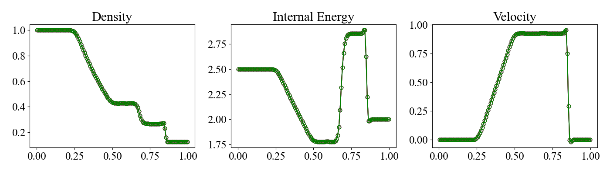

# 1D Hydrodynamic Shock Tube Problem

1次元の衝撃波管問題 {cite}`sod_1978JCoPh..27....1S` です。初期条件に不連続があるため、衝撃波、接触不連続、希薄波が発生します。この問題は、流体の方程式を解く数値スキームの検証によく用いられます。

MISOで提供しているテスト問題では、$x$, $y$, $z$の各方向に1次元問題を実施しているが、本ページでは、$x$方向の問題を説明する。

## Location

`problems/hd_shock_tube_1d/`

## Geometry

$0 \leq x \leq 1$.

## Initial Conditions

初期条件は、$x=0.5$で分離された左側と右側の状態で記述されます。比熱比は$\gamma = 1.4$とします。

$$
\begin{align*}
\begin{pmatrix}
\rho_\mathrm{L} \\
p_\mathrm{L} \\
v_\mathrm{L}
\end{pmatrix}
&=
\begin{pmatrix}
1.0 \\
1.0 \\
0.0 
\end{pmatrix} \\
\begin{pmatrix}
\rho_\mathrm{R} \\
p_\mathrm{R} \\
v_\mathrm{R}
\end{pmatrix}
&=
\begin{pmatrix}
0.125 \\
0.1 \\
0.0
\end{pmatrix}
\end{align*}
$$

## Boundary Conditions

すべての物理量について、対称境界条件を設定します。config_x.yamlで以下のように設定してあります。$y$方向と$z$方向の設定ファイルは、それぞれconfig_y.yamlとconfig_z.yamlにあります。

```yaml
# config_x.yaml
boundary_condition:
  # please use "standard" or "custom" for boundary_type
  boundary_type: standard

  periodic:
    x: false
    y: false
    z: false

  ro:
    x: [symmetric, symmetric]
    y: [symmetric, symmetric]
    z: [symmetric, symmetric]

    ...
```

## Results

pythonプログラムを実行して、結果のプロットを生成し、$x$, $y$, $z$方向の結果を比較できます。結果のプロットは py/problems/figs/hd_shock_tube_1d.pngにあります。

```shell
cd py/problems/
python hd_shock_tube_1d.py
```

本pythonプログラムでは、解析解も計算しており、数値解と解析解の比較も行っています。

