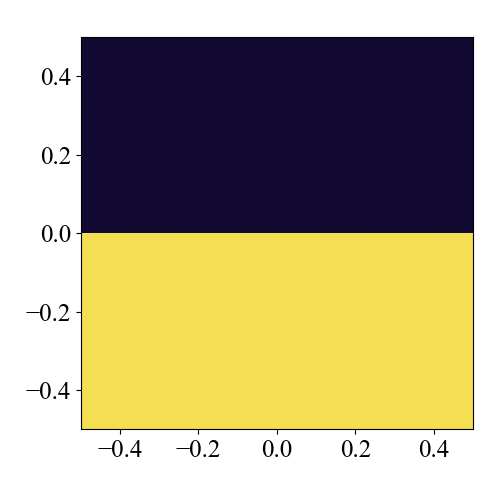

# Kelvin-Helmholtz Instability

ケルビン・ヘルムホルツ不安定性問題。設定した境界面を挟んで、上下で異なる速度を持つ流れが接しているときに発生する不安定性です。可視化のために、上下で密度を変えています。

## Location

`problems/kelvin_helmholtz/`

## Geometry

- $-0.5 \leq x \leq 0.5$
- $-0.5 \leq y \leq 0.5$.

## Initial Conditions

初期条件は、$y=0.0$で分離された上側と下側の状態と一定の圧力$p=2.5$で記述されます。比熱比は$\gamma = 1.4$とします。

$$
\begin{align*}
\begin{pmatrix}
\rho_\mathrm{U} \\
v_\mathrm{U}
\end{pmatrix}
&=
\begin{pmatrix}
1.0 \\
0.5
\end{pmatrix} \\
\begin{pmatrix}
\rho_\mathrm{L} \\
v_\mathrm{L}
\end{pmatrix}
&=
\begin{pmatrix}
2.0 \\
-0.5
\end{pmatrix}
\end{align*}
$$

## Boundary Conditions

$x$方向に周期境界条件を、$y$方向に対しては全ての物理量に対して対称境界条件を設定します。`config.yaml`では以下のように設定します。

```yaml
# config_x.yaml
boundary_condition:
  # please use "standard" or "custom" for boundary_type
  boundary_type: standard

  periodic:
    x: true
    y: false
    z: false

  ro:
    x: [symmetric, symmetric]
    y: [symmetric, symmetric]
    z: [symmetric, symmetric]

    ...
```

$x$方向の周期境界条件フラグをtrueに設定すると、対称境界条件が機能しなくなることに注意してください。

```yaml
  periodic:
    x: true  # when this flag is true, the symmetric boundary condition does not work
```  

## Results

用意されたpythonプログラムを実行することにより、結果のプロットは `py/problems/figs/kelvin_helmholtz/` に保存されます。

```shell
cd py/problems/
python kelvin_helmholtz.py
```




## 3D Version

3次元に変更するのも設定ファイルを変更するだけで簡単にできます。

```yaml
# config.yaml
grid:
  i_size: 512
  j_size: 512
  k_size: 512 # change from 1 to 512
```
