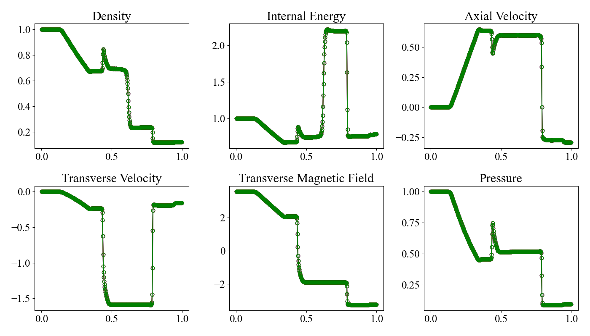

# 1D Magnetohydrodynamic Shock Tube Problem

This is one-dimensional magnetohydrodynamic shock tube problem {cite}`bri_1988JCoPh..75..400B`. Similar to the Sod shock tube problem, the initial condition has a discontinuity. This problem is commonly used to validate numerical schemes for solving magnetohydrodynamic equations.

In the test problems provided by MISO, we provide three one-dimensional problems with $x$, $y$, and $z$ axes. In this page, we explain the problem along the $x$ axis.

1次元の磁気流体力学的衝撃波管問題 {cite}`bri_1988JCoPh..75..400B` です。この問題は、磁気流体の方程式を解く数値スキームの検証によく用いられます。

MISOで提供しているテスト問題では、$x$, $y$, $z$の各方向に1次元問題を実施しているが、本ページでは、$x$方向の問題を説明する。


## Location

The problem is available at `problems/mhd_shock_tube_1d/`

## Geometry

The geometry extends $0 \leq x \leq 1$.

## Initial Conditions

The initial condition is described as the left and right states separated at $x=0.5$ with an axial magnetic field $B_x=0.75\sqrt{4\pi}$ as follows. The ratio of specific heats is set to $\gamma = 2$.

初期条件は、$x=0.5$で分離された左側と右側の状態と$B_x=0.75\sqrt{4\pi}$の軸方向の磁場で記述されます。比熱比は$\gamma = 2$とします。

$$
\begin{align*}
\begin{pmatrix}
\rho_\mathrm{L} \\
p_\mathrm{L} \\
v_\mathrm{L} \\
B_\mathrm{L}
\end{pmatrix}
&=
\begin{pmatrix}
1.0 \\
1.0 \\
0.0 \\
-\sqrt{4\pi}
\end{pmatrix} \\
\begin{pmatrix}
\rho_\mathrm{R} \\
p_\mathrm{R} \\
v_\mathrm{R} \\
B_\mathrm{R}
\end{pmatrix}
&=
\begin{pmatrix}
0.125 \\
0.1 \\
0.0 \\
\sqrt{4\pi}
\end{pmatrix} \\
\end{align*}
$$

where $B_\mathrm{L}$ and $B_\mathrm{R}$ are the transverse magnetic fields (in the $y$ direction). 

ここで、$B_\mathrm{L}$と$B_\mathrm{R}$は横方向の磁場（$y$方向）です。

## Boundary Conditions

We set symmetric boundary conditions for all physical quantities. In `config_x.yaml`, it is set as follows. The configure files for the $y$ and $z$ directions are available at `config_y.yaml` and `config_z.yaml`, respectively.

すべての物理量について、対称境界条件を設定します。`config_x.yaml`で以下のように設定してあります。$y$方向と$z$方向の設定ファイルは、それぞれ`config_y.yaml`と`config_z.yaml`にあります。

```yaml
# config_x.yaml
boundary_condition:
  # please use "standard" or "custom" for boundary_type
  boundary_type: standard

  periodic:
    x: false
    y: false
    z: false

  ro:
    x: [symmetric, symmetric]
    y: [symmetric, symmetric]
    z: [symmetric, symmetric]

    ...
```

## Results

You can run a python program to generate a result plot and compare the results with different directions, i.e., $x$, $y$, and $z$ directions. A result plot is available at `py/problems/figs/mhd_shock_tube_1d.png`.

pythonプログラムを実行して、結果のプロットを生成し、$x$, $y$, $z$方向の結果を比較できます。結果のプロットは `py/problems/figs/mhd_shock_tube_1d.png` にあります。

```shell
cd py/problems/
python mhd_shock_tube_1d.py
```

