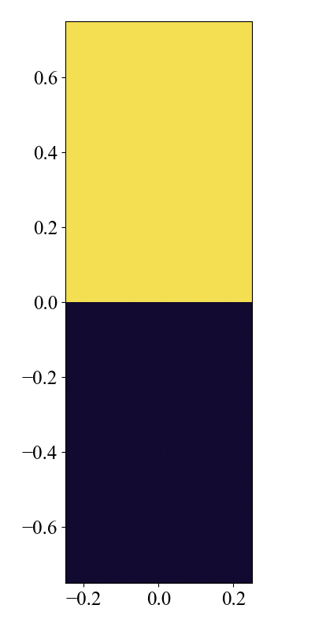

# Rayleigh Taylor Instability

This is the Rayleigh Taylor instability problem. The instability occurs when a dense fluid is above a lighter fluid in a gravitational field. 

レイリー・テイラー不安定性問題。重力場において、密度の高い流体が密度の低い流体の上にあるときに発生する不安定性です。

## Location

The problem is available at `problems/rayleigh_taylor/`

## Geometry

The calculation domain extends $-0.25 \leq x \leq 0.25$ and $-0.5 \leq y \leq 0.5$.

## Force

We apply a contant gravitational force in the negative $y$ direction. The gravitational acceleration is set to $g=0.1$. In `force.hpp`, it is set as follows.

$$
\frac{\partial \rho v_y}{\partial t} = [...] - \rho g
$$

```cpp
namespace force {
constexpr Real g_grav = 0.1;  // gravitational acceleration
}

...

  DEVICE inline Real y(MHDCoreType &qq, int i, int j, int k) {
#ifdef USE_CUDA
    return -qq.ro[grid.idx(i, j, k)] * force::g_grav;
#else
    return -qq.ro(i, j, k) * force::g_grav;
#endif
  }
```

## Initial Conditions

The initial condition is described as the upper and lower states separated at $y=0.0$. In the upper region ($y \geq 0$), the density $\rho = 2$ and in the lower region ($y < 0$), the density $\rho =1$.
The gas pressure is set to $p =p_0 - \rho g y$. The ratio of specific heats is set to $\gamma = 1.4$.

## Boundary Conditions

We set periodic boundary condition on the $x$ boundaries. Symmetric boundary conditions for all physical quantities are applied in the $y$ boundaries. In `config.yaml`, it is set as follows. 

$x$方向に周期境界条件を、$y$方向に対しては全ての物理量に対して対称境界条件を設定します。`config.yaml`では以下のように設定します。

```yaml
# config_x.yaml
boundary_condition:
  # please use "standard" or "custom" for boundary_type
  boundary_type: standard

  periodic:
    x: true
    y: false
    z: false

  ro:
    x: [symmetric, symmetric]
    y: [symmetric, symmetric]
    z: [symmetric, symmetric]

    ...
```

We note that when the periodic bounday condition flag is set to true, the symmetric boundary condition does not work.

$x$方向の周期境界条件フラグをtrueに設定すると、対称境界条件が機能しなくなることに注意してください。

```yaml
  periodic:
    x: true  # when this flag is true, the symmetric boundary condition does not work
```  

## Results

You can run a python program `rayleigh_taylor.py` to generate result plots. The result plots are stored at `py/problems/figs/raileigh_taylor/`.

用意されたpythonプログラムを実行することにより、結果のプロットは `py/problems/figs/rayleigh_taylor/` に保存されます。

```shell
cd py/problems/
python rayleigh_taylor.py
```



## 3D Version

We can easily change the problem to 3D by changing the configuration file.

3次元に変更するのも設定ファイルを変更するだけで簡単にできます。

```yaml
# config.yaml
grid:
  i_size: 384
  j_size: 1152
  k_size: 384 # change from 1 to 384
```
